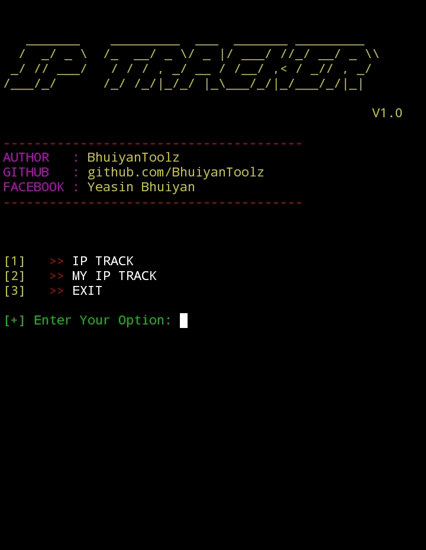
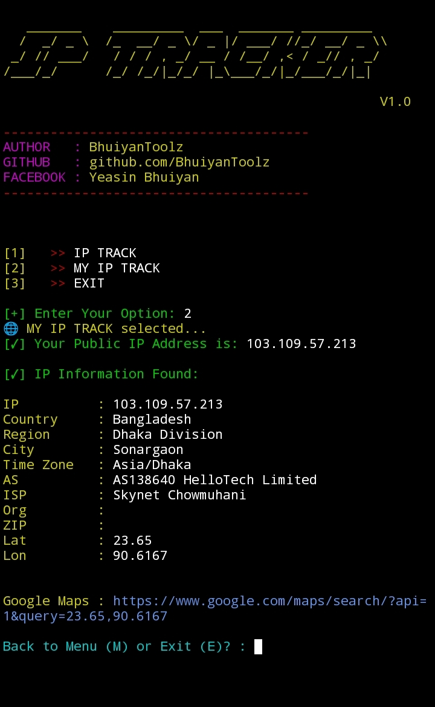

<!DOCTYPE html>
<html>
<header>
        
</header>

<h1 align="center">🌐 IP TRACKER TOOL 🔍</h1>

  
  
  
  

---

<h2>🚀 Features</h2>
<ul>
  <li>🔍 Track any public IP address</li>
  <li>🌍 Get location, ISP, timezone, and more</li>
  <li>📡 Track your own IP easily</li>
  <li>🎨 Colorful and clean CLI menu</li>
</ul>

<h2>📥 Installation</h2>

<strong>Just copy and paste the commands below 👇</strong>

<pre style="background:#f4f4f4; padding:10px; border:1px solid #ccc;"><code>
pkg update && pkg upgrade
pkg install python
pkg install git
pkg install python git -y
pip install requests
git clone https://github.com/BhuiyanToolsZ/IP-TRACKER.git
cd IP-TRACKER
python ip_tracker.py
</code></pre>

<h2>📌 Usage</h2>

Run the tool and select any option from the menu:

<pre>
[ ? ] Choose A Option

[ 1 ] IP TRACK       → Enter any IP address to get details
[ 2 ] MY IP TRACK    → Track your own public IP
[ 3 ] EXIT           → Quit the tool
</pre>

<strong>📍 Example:</strong>

<pre>
Enter IP: 8.8.8.8

IP       : 8.8.8.8
Country  : United States
Region   : California
City     : Mountain View
ISP      : Google LLC
Timezone : America/Los_Angeles
Lan & lon: 23.65 90.6167
Maps     : 
 
More......
</pre>

  ⚠️This tool is made for educational purposes only.
Do not use it for illegal activities.
You are fully responsible for your own actions while using this tool.
Developer is not responsible for any kind of misuse or damage.
<h2 align="center">🙋‍♂️ Developer Info</h2>

  
  
  
  
  
   

</html>
